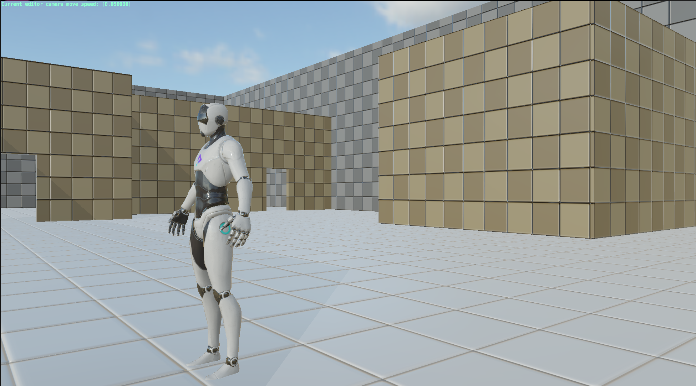
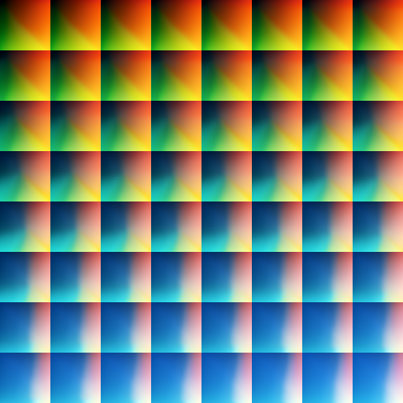

# 作业二实验报告
无滤镜原图：

## 1. 实现ColorGrading功能

设计思路：使用引擎给好的框架和lut02图，通过blue映射到lut图上的ceil值和floor值，查找到两个cell，计算red和green的offset，用blue映射后的小数部分作为权重，插值这两个cell中的red和green，最终得到结果。

## 2. 个性化LUT图

设计思路： 尝试使用二维的lut图，重新计算offset和cell，优化shader为通用性，通过更改define的CELLS_PER_ROW和CELLS_PER_COLUM可以应用于任何lut图。

## 3. blur

设计思路：起初因为引擎用的subpass，不能访问相邻的像素，只能做单像素后处理。后来受大佬启发，添加两个buffer，将framebuffer作为输入传到blur pass中，使用时切换不同的flag的buffer，最终实现了blur效果。关于这一点我想问下项目组，一般来说引擎的处理是否应该将UI的渲染和游戏画面的渲染分为两个renderpass，而小引擎中是用的subpass，可能会导致一些问题的出现。