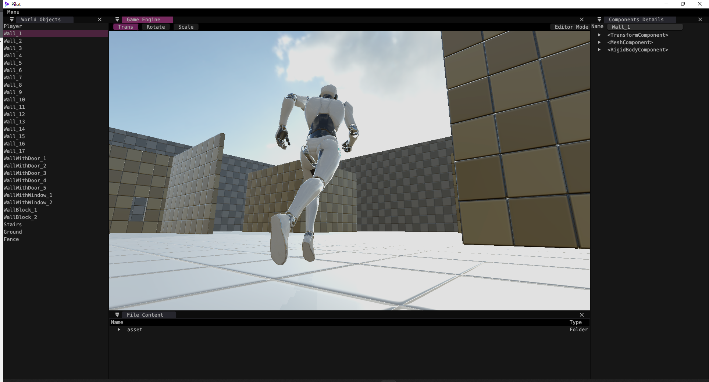
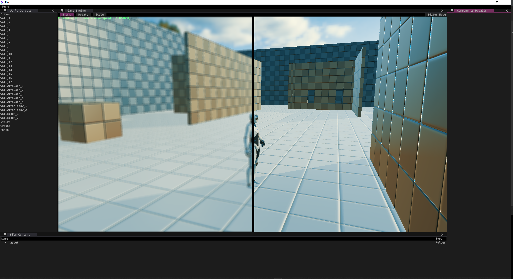
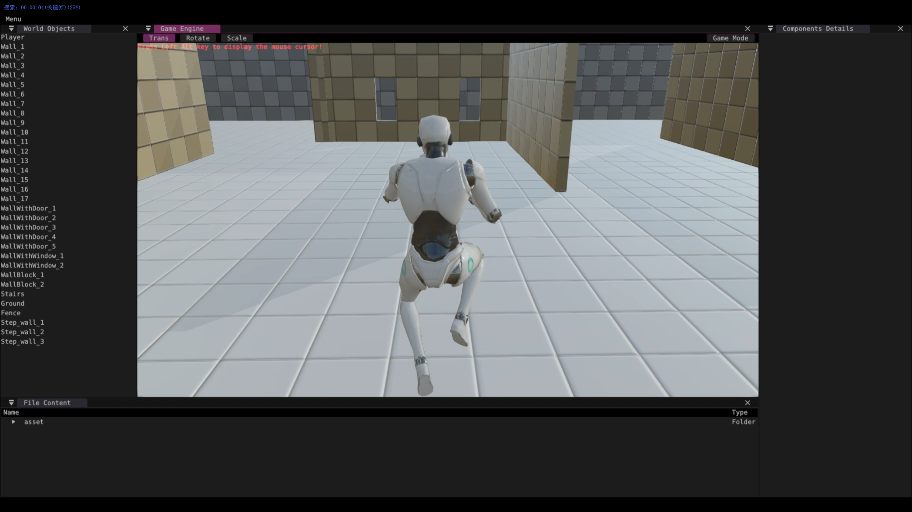
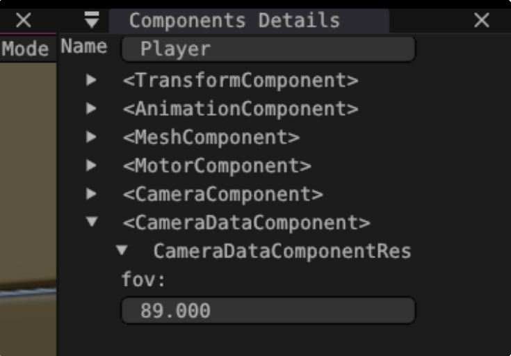

# 学习GAMES104的作业

本仓库为学习GAMES104时做的作业，具体实现看我Fork的仓库里的4个分支：[kyriewxcode/Piccolo](https://github.com/kyriewxcode/Piccolo)

具体思路在以下目录的report.pdf

- ## PA01 Build

- ## PA02 Rendering

- ## PA03 Animation-Physics

- ## PA04 Tool chains

